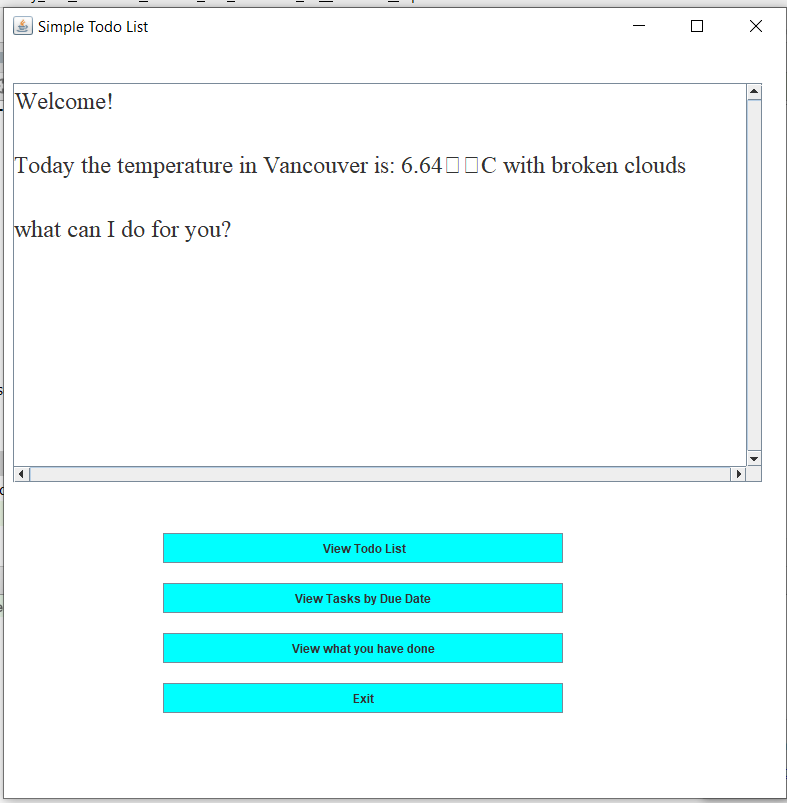
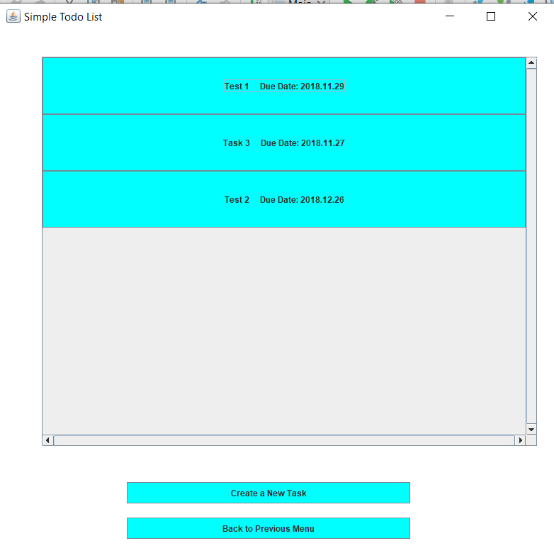
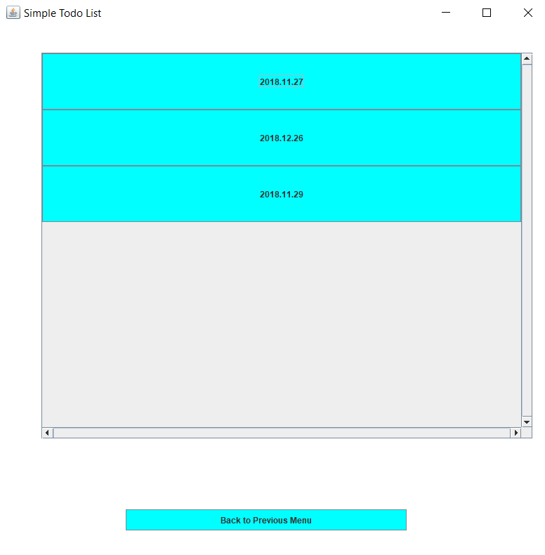
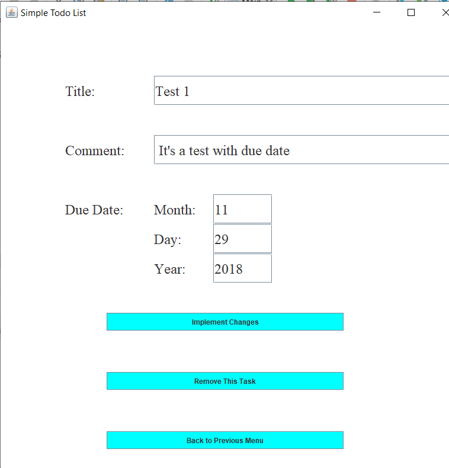

# Personal Project for CPSC 210 WT1

:arrow_forward: This is my very first app developed in Java and GUI for my class project.

:arrow_forward: A simple To-Do List app which allows you to add Tasks with title, comment, and due date. Then you
                you can view them by the order you added or by due date, or edit them, or cross them off.

